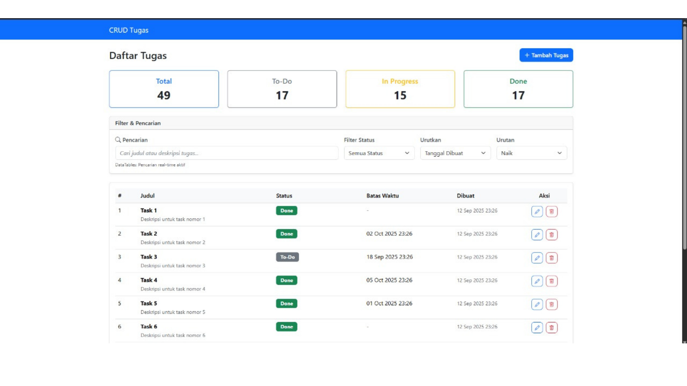
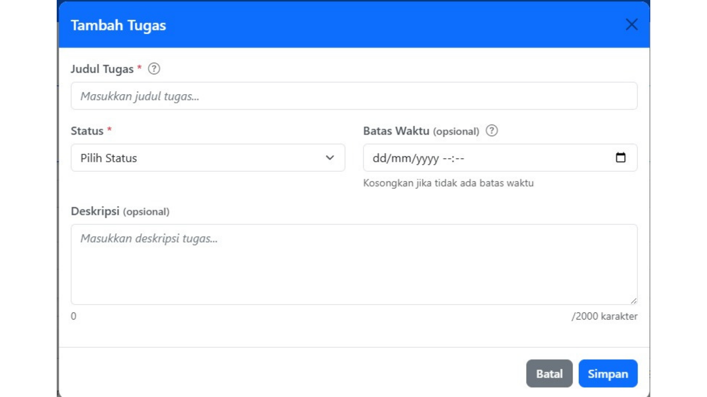
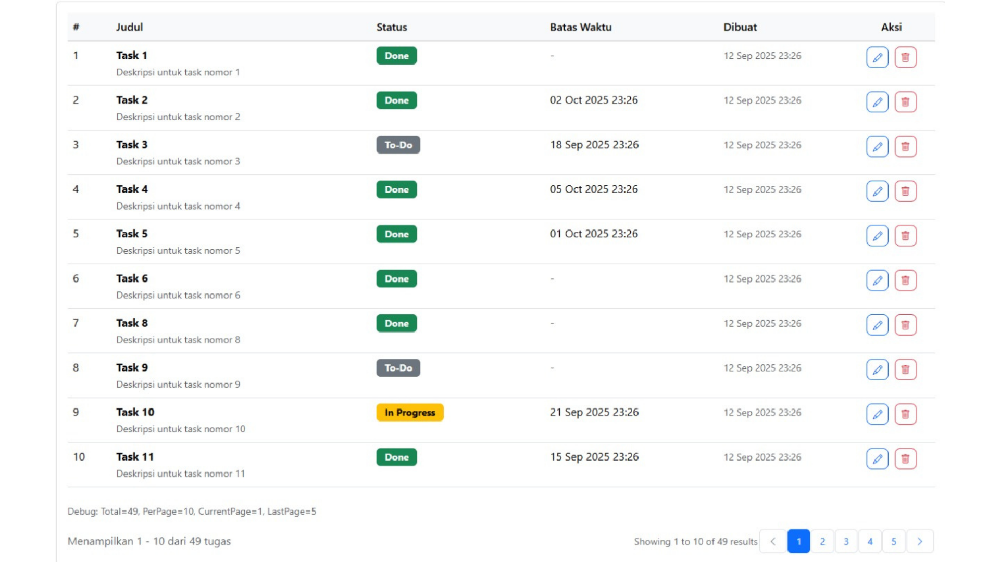

# 📝 CRUD Tugas - Laravel Application

[](https://laravel.com)
[](https://php.net)
[](https://getbootstrap.com)
[](https://opensource.org/licenses/MIT)

Aplikasi manajemen tugas modern dengan fitur CRUD lengkap, menggunakan Laravel sebagai backend dan Bootstrap + jQuery untuk frontend yang interaktif dan responsif.

## 📸 Screenshot

### Dashboard Utama


### Modal Create/Edit Task


### DataTables untuk Dataset Besar


## 🚀 Fitur Utama

### ✨ Core Features
- ✅ **CRUD Operations** - Create, Read, Update, Delete tugas dengan Ajax
- 🔍 **Advanced Search** - Pencarian real-time di judul dan deskripsi
- 📊 **Filter & Sort** - Filter berdasarkan status, sorting berdasarkan tanggal
- 📅 **Due Date Management** - Notifikasi tugas yang akan deadline dan terlambat
- 📈 **Statistics Dashboard** - Overview jumlah tugas per status

### 🎨 User Experience
- 🖥️ **Responsive Design** - Optimal di desktop, tablet, dan mobile
- ⚡ **No Page Reload** - Semua operasi menggunakan Ajax untuk UX yang smooth
- 🎭 **Real-time Validation** - Feedback instant saat mengisi form
- 🔔 **Toast Notifications** - Notifikasi sukses/error yang tidak mengganggu
- 🎯 **Smart Forms** - Auto-format, character counter, validation hints

### 🚄 Performance & Scalability
- 📊 **DataTables Integration** - Pagination, search, sort untuk dataset besar
- 🏎️ **Server-side Processing** - Ready untuk jutaan records
- 💾 **Database Optimization** - Index strategy untuk query yang efisien
- 🎪 **Progressive Enhancement** - Fallback untuk JavaScript disabled

## 🛠️ Tech Stack

| Component | Technology | Version |
|-----------|------------|---------|
| **Backend Framework** | Laravel | 10.x |
| **Database ORM** | Eloquent | Built-in |
| **Frontend Framework** | Bootstrap | 5.3.2 |
| **JavaScript Library** | jQuery | 3.7.1 |
| **Table Enhancement** | DataTables | 1.13.7 |
| **Icons** | Bootstrap Icons | 1.11.1 |
| **Database** | SQLite/MySQL | 5.7+ |
| **PHP Version** | PHP | 8.1+ |

## 📋 System Requirements

### Minimum Requirements
- **PHP**: 8.1 atau lebih tinggi
- **Composer**: Latest stable version
- **Database**: SQLite (default) atau MySQL 5.7+
- **Web Server**: Built-in PHP server atau Apache/Nginx

### Recommended Requirements
- **PHP**: 8.2+ dengan OPcache enabled
- **Memory**: 512MB RAM minimum
- **Storage**: 100MB free space
- **Browser**: Chrome 90+, Firefox 88+, Safari 14+, Edge 90+

## 🚀 Quick Start

### 1️⃣ Clone & Setup
```bash
# Clone repository
git clone https://github.com/your-username/crud-tugas.git
cd crud-tugas

# Install dependencies
composer install

# Setup environment
cp .env.example .env
php artisan key:generate
2️⃣ Database Configuration
Option A: SQLite (Recommended for Testing)
bash# Create SQLite database
touch database/database.sqlite

# Update .env
DB_CONNECTION=sqlite
DB_DATABASE=database/database.sqlite
Option B: MySQL
bash# Create MySQL database
mysql -u root -p -e "CREATE DATABASE crud_tugas CHARACTER SET utf8mb4 COLLATE utf8mb4_unicode_ci;"

# Update .env
DB_CONNECTION=mysql
DB_HOST=127.0.0.1
DB_PORT=3306
DB_DATABASE=crud_tugas
DB_USERNAME=your_username
DB_PASSWORD=your_password
3️⃣ Run Application
bash# Run migrations
php artisan migrate

# Start development server
php artisan serve
🎉 Aplikasi siap digunakan di http://localhost:8000
📚 Detailed Documentation
🏗️ Project Structure
crud-tugas/
├── app/
│   ├── Http/
│   │   ├── Controllers/
│   │   │   ├── TaskController.php       # Main CRUD controller
│   │   │   └── DataTableController.php  # Server-side processing
│   │   └── Requests/
│   │       ├── StoreTaskRequest.php     # Create validation
│   │       └── UpdateTaskRequest.php    # Update validation
│   └── Models/
│       └── Task.php                     # Task Eloquent model
├── database/
│   └── migrations/
│       └── xxxx_create_tasks_table.php  # Database schema
├── resources/views/
│   ├── layouts/
│   │   └── app.blade.php               # Main layout
│   └── tasks/
│       ├── index.blade.php             # Task list page
│       ├── _form.blade.php             # Reusable form component
│       └── _modal.blade.php            # Modal component
├── public/
│   ├── css/
│   │   └── custom.css                  # Custom styling
│   └── js/
│       ├── tasks.js                    # Main JavaScript functionality
│       ├── client-validation.js        # Client-side validation
│       └── task-helpers.js             # Utility functions
└── routes/
    └── web.php                         # Application routes
🗄️ Database Schema
Tasks Table
ColumnTypeDescriptionidBIGINT UNSIGNEDPrimary keytitleVARCHAR(255)Task title (required)descriptionTEXTTask description (optional)statusENUM'To-Do', 'In Progress', 'Done'due_atDATETIMEDeadline (optional)created_atTIMESTAMPCreation timestampupdated_atTIMESTAMPLast update timestamp
Indexes

tasks_status_index - For status filtering
tasks_due_at_index - For due date sorting
tasks_status_due_at_index - Composite index for combined queries

🔧 API Endpoints
Web Routes
MethodURINameDescriptionGET/homeRedirect to tasks indexGET/taskstasks.indexDisplay task listPOST/taskstasks.storeCreate new taskGET/tasks/{id}tasks.showShow task detailsPUT/PATCH/tasks/{id}tasks.updateUpdate taskDELETE/tasks/{id}tasks.destroyDelete task
Ajax API Responses
javascript// Success Response
{
    "success": true,
    "message": "Tugas berhasil dibuat!",
    "data": {
        "id": 1,
        "title": "Task Title",
        "status": "To-Do",
        // ... other fields
    }
}

// Error Response (422)
{
    "success": false,
    "message": "Data tidak valid",
    "errors": {
        "title": ["Judul tugas wajib diisi"],
        "status": ["Status wajib dipilih"]
    }
}
🎨 Frontend Components
JavaScript Modules

tasks.js - Main CRUD operations, Ajax handling
client-validation.js - Real-time form validation
task-helpers.js - Utility functions, network error handling

CSS Features

Responsive Design - Mobile-first approach
Custom Animations - Smooth transitions, shake effects
Status Indicators - Color-coded badges, progress bars
Form Enhancements - Validation states, character counters

🔍 Features Deep Dive
1. Advanced Search & Filtering
javascript// Search works on title and description
GET /tasks?search=meeting
GET /tasks?status=In%20Progress
GET /tasks?sort=due_at&order=asc
2. DataTables Integration

Auto-activation when dataset > 25 records
Server-side processing ready for large datasets
Custom filters integrated with Laravel backend
Responsive columns hide/show based on screen size

3. Real-time Validation

Client-side validation with immediate feedback
Server-side validation with Form Requests
Custom error messages in Bahasa Indonesia
Visual indicators with icons and animations

4. Smart Due Date Handling

Overdue detection with visual warnings
Upcoming alerts for tasks due within 24 hours
Flexible validation (strict on create, flexible on update)
Asia/Jakarta timezone support

🧪 Testing
Manual Testing Checklist
bash# 1. Start application
php artisan serve

# 2. Basic CRUD Operations
□ Create new task
□ Edit existing task
□ Delete task with confirmation
□ View task details

# 3. Search & Filter
□ Search by title/description
□ Filter by status
□ Sort by creation date
□ Sort by due date

# 4. Validation
□ Submit empty form (should show errors)
□ Submit invalid data (should show field errors)
□ Submit valid data (should succeed)

# 5. UI/UX
□ Modal opens/closes properly
□ Toast notifications appear
□ Responsive design on mobile
□ DataTables functions (if >25 records)
Automated Testing
bash# Run all tests
php artisan test

# Run specific test suites
php artisan test --testsuite=Feature
php artisan test --testsuite=Unit

# Generate code coverage report
php artisan test --coverage
🚀 Production Deployment
Environment Setup
bash# Set production environment
APP_ENV=production
APP_DEBUG=false

# Configure database
DB_CONNECTION=mysql
DB_HOST=your-production-db-host
DB_DATABASE=your-production-db

# Set cache drivers
CACHE_DRIVER=redis
SESSION_DRIVER=redis
QUEUE_CONNECTION=redis
Optimization Commands
bash# Clear and cache configs
php artisan config:cache
php artisan route:cache
php artisan view:cache

# Optimize composer autoloader
composer install --optimize-autoloader --no-dev
Security Checklist

 Set strong APP_KEY
 Configure proper file permissions
 Set up SSL/HTTPS
 Configure CORS if needed
 Set up database backups
 Configure error logging

🤝 Contributing
Development Setup
bash# Fork repository and clone
git clone https://github.com/YOUR-USERNAME/crud-tugas.git

# Create feature branch
git checkout -b feature/amazing-feature

# Make changes and commit
git commit -m "feat: add amazing feature"

# Push and create Pull Request
git push origin feature/amazing-feature
Code Style Guidelines

Follow PSR-12 coding standards
Use meaningful variable names
Add comments for complex logic
Write descriptive commit messages
Include tests for new features

Commit Convention
feat: add new feature
fix: bug fixes
docs: documentation changes
style: formatting, missing semi colons, etc
refactor: code restructuring
test: adding missing tests
chore: maintenance tasks
🐛 Troubleshooting
Common Issues
Database Connection Error
bash# Check database configuration
php artisan tinker
>>> DB::connection()->getPdo();

# Clear config cache
php artisan config:clear
Ajax Requests Failing
bash# Check CSRF token in meta tag
# Verify routes are correct
php artisan route:list --path=tasks

# Check JavaScript console for errors
DataTables Not Loading
bash# Verify CDN links in layout
# Check browser console for JavaScript errors
# Ensure jQuery loads before DataTables
Validation Not Working
bash# Check Form Request classes
# Verify JavaScript validation file loads
# Check browser console for errors
📞 Support
Getting Help

📖 Documentation: Check this README thoroughly
🐛 Bug Reports: Create issue with detailed description
💡 Feature Requests: Describe use case and benefits
📧 Contact: Email for urgent issues

FAQ
Q: Bagaimana cara menambah status baru selain To-Do, In Progress, Done?
A: Edit konstanta STATUSES di model Task.php dan update migration enum.
Q: Bagaimana cara mengubah timezone dari Asia/Jakarta?
A: Edit file config/app.php bagian timezone.
Q: Bagaimana cara menambah field baru di task?
A: Buat migration baru, update model, form request, dan view.
Q: Bagaimana cara mengaktifkan server-side processing DataTables?
A: Server-side endpoint sudah tersedia di DataTableController.php, tinggal konfigurasi frontend.
📄 License
This project is licensed under the MIT License - see the LICENSE file for details.
👨‍💻 Author
[kazrika]

🙏 Acknowledgments

Laravel - The PHP framework for web artisans
Bootstrap - The most popular CSS framework
DataTables - Advanced table plugin for jQuery
jQuery - Fast, small, feature-rich JavaScript library